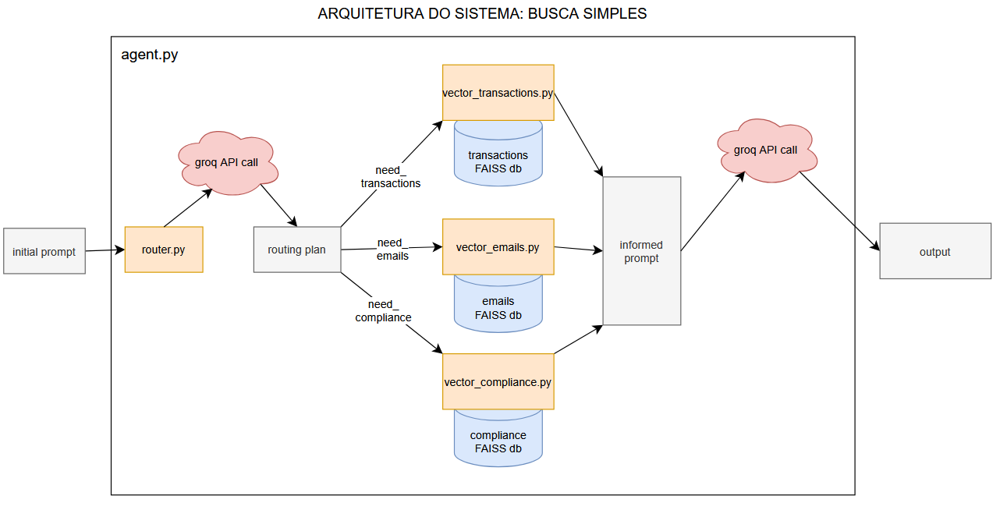
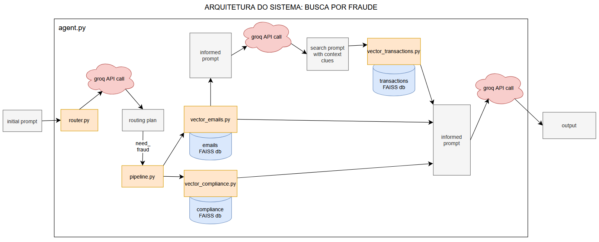

# CHATBOT DUNDER MIFFLIN

Chatbot com implementação de RAG para responder perguntas do usuário usando dados relevantes de emails, transações, ou políticas de conformidade. Faz uso tanto de LLMs por API quanto LLMs locais para a criação e busca em bases de dados em vetores.

Por padrão utiliza o modelo Llama 3.1 8B Instant via Groq para sintetização, BGE-M3 via Ollama para criação e busca de bases de dados em vetores (via FAISS db).

### [Vídeo demonstração](https://drive.google.com/file/d/1ME4IzrIN0ZsU8k0Hy8ZX0eYmEoVoyxTP/view?usp=sharing)

## Arquitetura:



## Instruções de execução
### Pré-requisitos:
- Python 3
- Ollama
- Chave API Groq
 
Na raiz do projeto crie um arquivo *.env* e insira sua chave de API GROQ (Há um arquivo de exemplo de como fazer isso).

Instale o modelo BGE-M3 em sua instalação de Ollama usando o seguinte comando:
```bash
ollama pull bge-m3
```

Para executar, é recomendado usar um ambiente virtual de Python usando o seguinte comando na raiz do repositório:
```bash
python -m venv .venv
```

Após criar o ambiente, inicie ele usando o seguinte comando 

```bash
# (Windows)
/.venv/Scripts/Activate.ps1
```
```bash
# (Linux)
source .venv/Scripts/activate
```

Dentro do ambiente virtual, instale as dependências usando o seguinte comando:
```bash
pip install -r requirements.txt
```

Com as dependências instaladas, você pode executar o agente do chatbot por meio do arquivo *agent.py*:
```bash
cd dunder_agent
python agent.py
```
